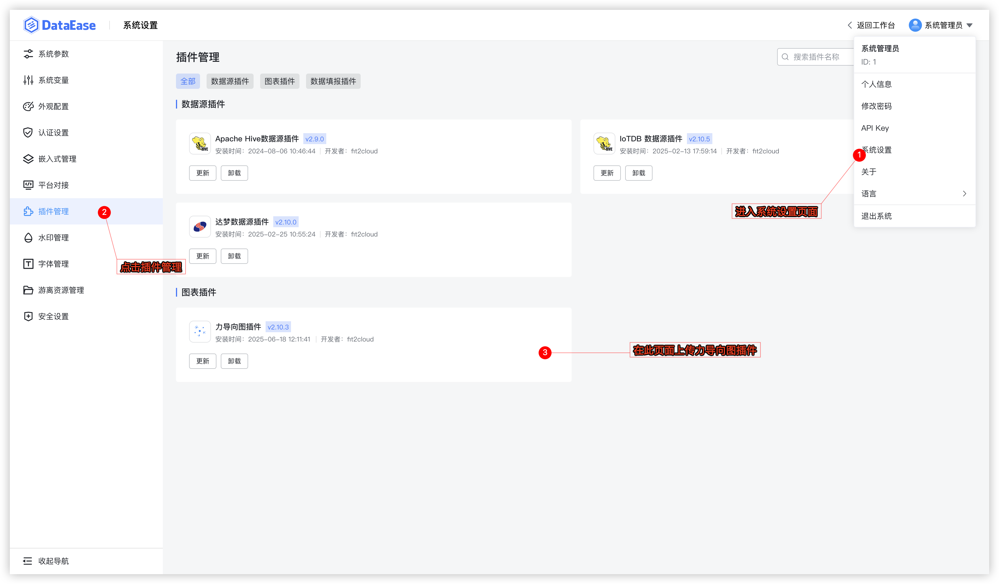
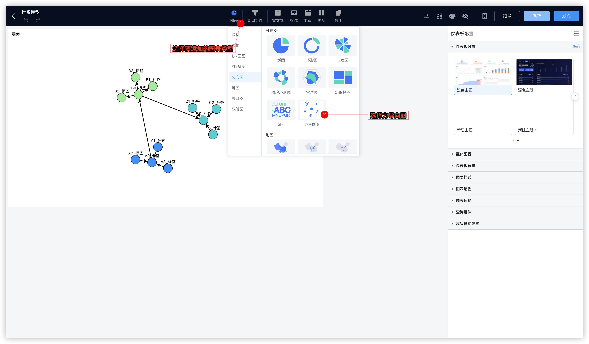
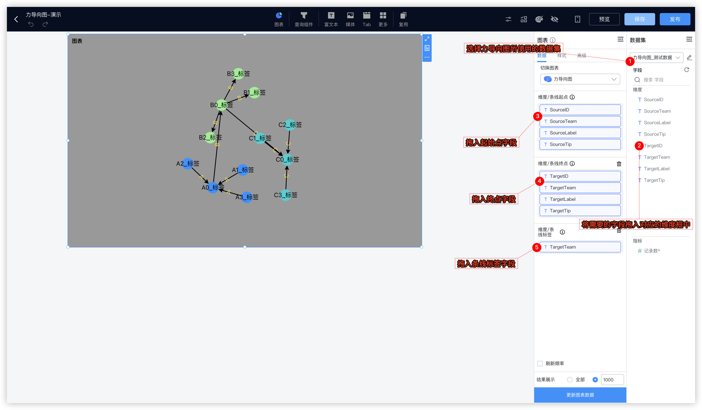
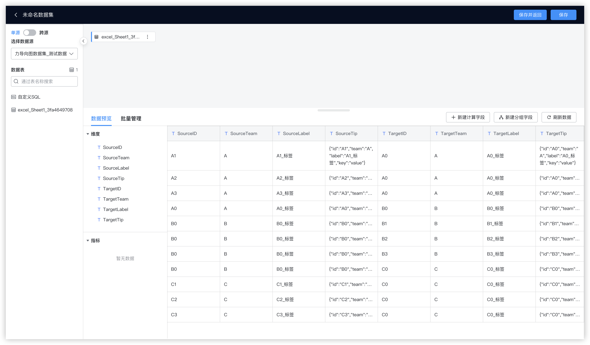
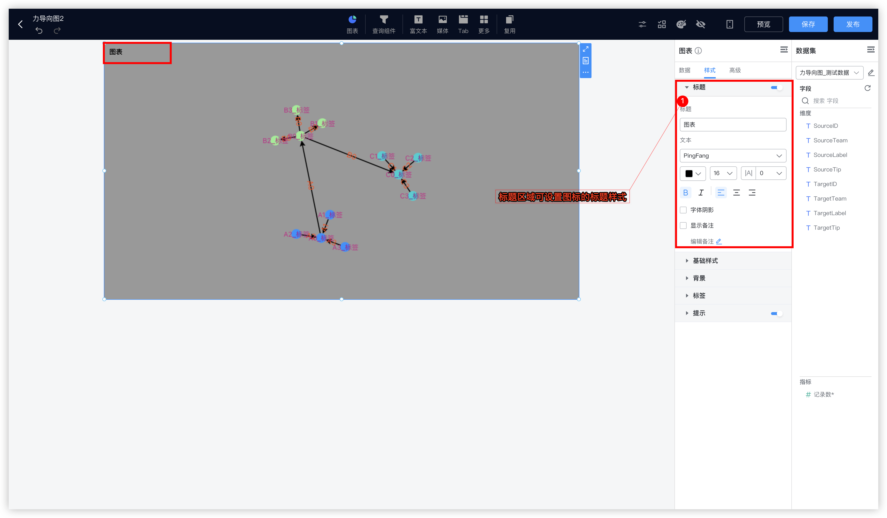
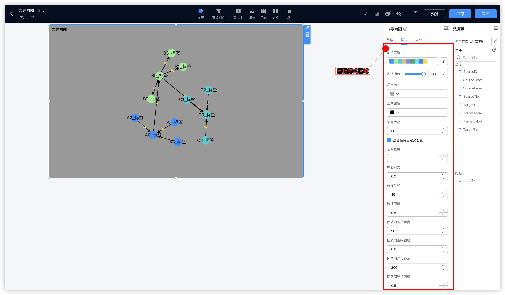
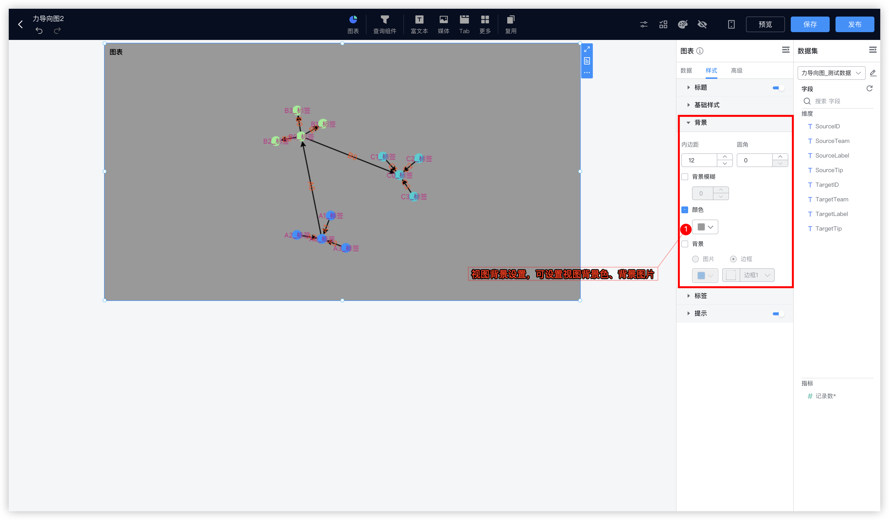
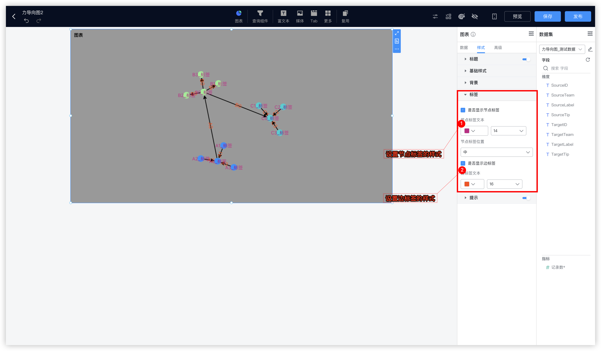
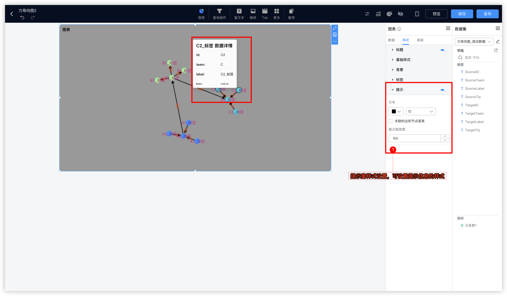

# 力导向图插件使用指南

## 一、使用步骤

### 步骤一：登录 DataEase 系统

打开浏览器，访问 DataEase 系统并完成登录。

### 步骤二：上传插件

上传插件（插件：d3force-backend-2.10.8.jar，可联系管理员获取插件），若插件已经上传，无需重新上传。



上传插件后需重启 DataEase 服务，进入部署 DataEase 所在服务器的后台，执行以下命令：

```bash
docker restart dataease
```

### 步骤三：创建视图

创建仪表板/数据大屏，选择力导向图。



### 步骤四：准备数据

选择数据集，并配置维度数据。



力导向图本质上是从起点到终点的点和边的数据的展示，因此，使用力导向图进行数据展示，数据中需要包含起点数据（起始点的 ID、Team、Label、Tip）、终点数据（终点的 ID、Team、Label、Tip）、以及边的标签数据（起点到终点的条线标签）。

各字段说明如下：

| 字段         | 说明                               |
| ------------ | ---------------------------------- |
| SourceID     | 起始点的唯一标识                   |
| SourceTeam   | 起始点所属的分组                   |
| SourceLabel  | 起始点的标签                       |
| SourceTip    | 起始点的提示信息（JSON 格式）      |
| TargetID     | 终点的唯一标识                     |
| TargetTeam   | 终点所属的分组                     |
| TargetLabel  | 终点的标签                         |
| TargetTip    | 终点的提示信息（JSON 格式）        |
| EdgeLabel    | 起点到终点的边标签                 |

- 起始点的 ID、Team、Label、Tip 分别表示：起始点的唯一标识、起始点所属的分组、起始点的标签、起始点的提示信息。
- 终点的 ID、Team、Label、Tip 分别表示：终点的唯一标识、终点所属的分组、终点的标签、终点的提示信息。
- 边标签数据用于展示起点到终点的条线标签。

> ⚠️ 注：
> 1. **SourceTip** 和 **TargetTip** 的数据格式为 JSON 键值对格式。
> 2. 数据中同一个节点的数据保持一致，根据 ID 唯一标识判断节点。

**数据示例：**

| SourceID | SourceTeam | SourceLabel | SourceTip                                              | TargetID | TargetTeam | TargetLabel | TargetTip                                              | EdgeLabel   |
| -------- | ---------- | ----------- | ------------------------------------------------------ | -------- | ---------- | ----------- | ------------------------------------------------------ | ----------- |
| A1       | A          | A1_标签     | {"id":"A1","team":"A","label":"A1_标签","key":"value"} | A0       | A          | A0_标签     | {"id":"A0","team":"A","label":"A0_标签","key":"value"} | A1-A0边标签 |
| A2       | A          | A2_标签     | {"id":"A2","team":"A","label":"A2_标签","key":"value"} | A0       | A          | A0_标签     | {"id":"A0","team":"A","label":"A0_标签","key":"value"} | A2-A0边标签 |
| A3       | A          | A3_标签     | {"id":"A3","team":"A","label":"A3_标签","key":"value"} | A0       | A          | A0_标签     | {"id":"A0","team":"A","label":"A0_标签","key":"value"} | A3-A0边标签 |
| A0       | A          | A0_标签     | {"id":"A0","team":"A","label":"A0_标签","key":"value"} | B0       | B          | B0_标签     | {"id":"B0","team":"B","label":"B0_标签","key":"value"} | A0-B0边标签 |
| B0       | B          | B0_标签     | {"id":"B0","team":"B","label":"B0_标签","key":"value"} | B1       | B          | B1_标签     | {"id":"B1","team":"B","label":"B1_标签","key":"value"} | B0-B1边标签 |
| B0       | B          | B0_标签     | {"id":"B0","team":"B","label":"B0_标签","key":"value"} | B2       | B          | B2_标签     | {"id":"B2","team":"B","label":"B2_标签","key":"value"} | B0-B2边标签 |
| B0       | B          | B0_标签     | {"id":"B0","team":"B","label":"B0_标签","key":"value"} | B3       | B          | B3_标签     | {"id":"B3","team":"B","label":"B3_标签","key":"value"} | B0-B3边标签 |
| B0       | B          | B0_标签     | {"id":"B0","team":"B","label":"B0_标签","key":"value"} | C0       | C          | C0_标签     | {"id":"C0","team":"C","label":"C0_标签","key":"value"} | B0-C0边标签 |
| C1       | C          | C1_标签     | {"id":"C1","team":"C","label":"C1_标签","key":"value"} | C0       | C          | C0_标签     | {"id":"C0","team":"C","label":"C0_标签","key":"value"} | C1-C0边标签 |
| C2       | C          | C2_标签     | {"id":"C2","team":"C","label":"C2_标签","key":"value"} | C0       | C          | C0_标签     | {"id":"C0","team":"C","label":"C0_标签","key":"value"} | C2-C0边标签 |
| C3       | C          | C3_标签     | {"id":"C3","team":"C","label":"C3_标签","key":"value"} | C0       | C          | C0_标签     | {"id":"C0","team":"C","label":"C0_标签","key":"value"} | C3-C0边标签 |

基于以上数据创建数据集：



---

## 二、样式配置

### 1. 标题样式

配置图表标题的样式属性。



### 2. 基础样式

基础样式支持配置以下内容：

- **节点的配置方案**：支持选择不同的配色方案，按照分组的顺序依次配色
- **不透明度**：节点颜色的不透明度
- **边框颜色**：节点边框的颜色
- **边线颜色**：节点到节点的条线的颜色
- **节点大小**：节点的尺寸大小，当节点数量过多时，建议将尺寸调小
- **是否使用自定义配置**：以下属性内容均属于自定义配置的属性，不勾选时以下属性将不生效
- **边的宽度**：节点到节点的条线的宽度（取值范围 0-1）
- **中心引力**：节点与节点间的相互引力（取值范围 0-1）
- **碰撞半径**：节点碰撞后作用力的半径（取值范围 0-100）
- **碰撞强度**：节点碰撞后作用力的强度（取值范围 0-1）
- **团队内连接距离**：同一个分组内的节点之间的连接距离（取值范围 0-1000）
- **团队内连接强度**：同一个分组内的节点之间的连接力的强度（取值范围 0-1）
- **团队间连接距离**：不同分组的节点之间的连接距离（取值范围 0-1000）
- **团队间连接强度**：不同分组的节点之间的连接力的强度（取值范围 0-1）

> ⚠️ 注：当节点数据过多时，建议关闭【是否使用自定义配置】，并将【节点大小】调至 10 以内。



### 3. 背景样式

支持配置视图的内边距、圆角、背景模糊、背景颜色、背景图片、背景边框等样式属性。



### 4. 标签属性样式

可设置节点标签的样式以及边标签的样式：

- **是否显示节点标签**：控制节点标签的显示/隐藏
- **节点标签文本**：设置节点标签文本的颜色和大小
- **节点标签位置**：支持设置上、中、下、左、右
- **是否显示边标签**：控制边标签的显示/隐藏
- **边标签文本**：设置边标签文本的颜色和大小

> ⚠️ 注：当节点数据过多时，建议关闭【是否显示节点标签】和【是否显示边标签】。可通过鼠标点击节点触发提示窗口展示，通过提示信息查看节点信息。



### 5. 提示样式

- **开启提示时**：通过鼠标点击节点/边触发提示窗口展示，提示窗口可展示节点 Tip 字段信息。且鼠标移动至节点上方时节点呈现选中样式，若开启【关联的边和节点高亮】则此节点关联的边和节点都会呈现高亮的样式。
- **关闭提示时**：点击事件没有响应，只有鼠标移动至节点上方时的选中样式。

具体配置项：

- **文本**：可设置提示窗中的文本的颜色和大小
- **关联的边和节点高亮**：控制鼠标移动至节点上方时，是否显示此节点关联的边和节点呈现高亮的样式
- **提示窗高度**：控制提示窗口的高度（取值范围：30-1000）



